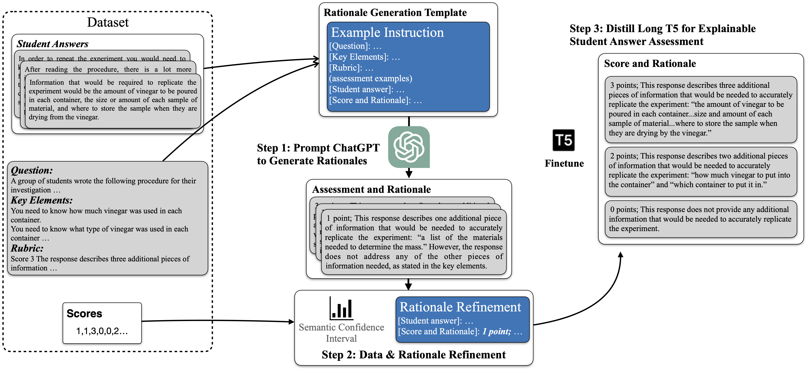

# Distilling ChatGPT for Explainable Automated Student Answer Assessment
Jiazheng Li, Lin Gui, Yuxiang Zhou, David West, Cesare Aloisi and Yulan He


## Abstract
Providing explainable and faithful feedback is crucial for automated student answer assessment. In this paper, we introduce a novel framework that explores using ChatGPT, a cutting-edge large language model, for the concurrent tasks of student answer scoring and rationale generation. We identify the appropriate instructions by prompting ChatGPT with different templates to collect the rationales, where inconsistent rationales are refined to align with marking standards. The refined ChatGPT outputs enable us to fine-tune a smaller language model that simultaneously assesses student answers and provides rationales. Extensive experiments on the benchmark dataset show that the proposed method improves the overall QWK score by 11% compared to ChatGPT. Furthermore, our thorough analysis and human evaluation demonstrate that the rationales generated by our proposed method are comparable to those of ChatGPT. Our approach provides a viable solution to achieve explainable automated assessment in education.

<p align="center">

</p>

## Getting Started

Project structure:
```
CUE
├── README.md
├── environment.yml     # Conda environment     
├── train.py            # Train rationale generation model
├── train_cls.py        # Train classification baseline
├── dataset
│   ├── ...
│   └── README.md       # Pls read this for dataset detail
└── aera
    └── ...
```

### Creating an environment from an environment.yml file

```python
conda env create -f environment.yml
```

### Define the path you save models

In the ```constants.py```, you will find two constant paths defined at the top:
```python
DATAFOLDER = "/path/to/the/folder/"
CACHEFOLDER = "/path/to/the/folder/transfomers_cache/"
```
The ```DATAFOLDER``` is the path to save all the trianed models and the ```CACHEFOLDER``` is the path used to store transformers package's cached models.

## An example to use AERA
#### Finetune classification baseline
```bash
python train_cls.py -d $dataset_name -b $batch_size -e $num_of_epochs -m $base_model -p $output_path -r $rounds_to_train
```
Example:
```bash
python train_cls.py -d asap-1 -b 16 -e 30 -m bert-base-uncased -p bert-base-uncased-asap-1 -r 5
```
#### Finetune rationale generation model
```bash
python train.py -d $dataset_name -b $batch_size -e $num_of_epochs -p $output_path -r $rounds_to_train
```
Example:
```bash
python train_cls.py -d asap-1 -b 8 -e 30 -p longt5_large-asap-1 -r 5
```

## Cite our work
```bib
@misc{li2023distilling,
      title={Distilling ChatGPT for Explainable Automated Student Answer Assessment}, 
      author={Jiazheng Li and Lin Gui and Yuxiang Zhou and David West and Cesare Aloisi and Yulan He},
      year={2023},
      eprint={2305.12962},
      archivePrefix={arXiv},
      primaryClass={cs.CL}
}
```

